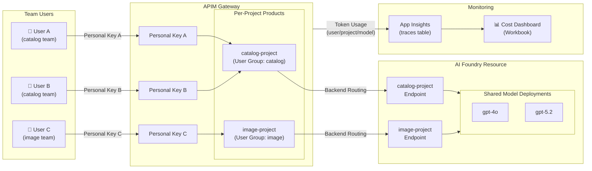
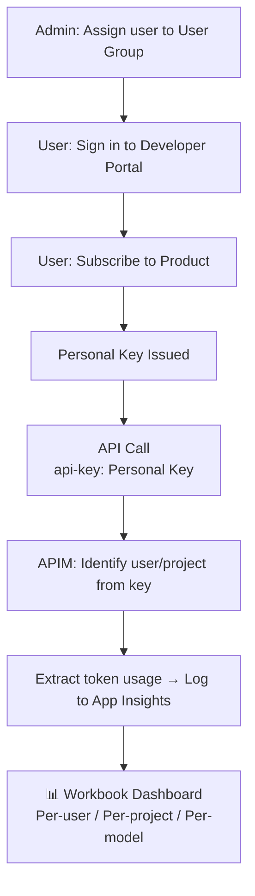

# apim-foundry-cost-governance

> 🇰🇷 [한국어 버전](README.md)

This project deploys Azure API Management (APIM) as a gateway in front of AI Foundry, providing per-team access control, rate limiting, and token-usage monitoring — all with a single Terraform deployment. Administrators add Foundry Projects per team, issue keys to users, and track per-project, per-model, and per-user costs in real time through an Application Insights Workbook.

## Architecture



### How Keys Work



- **Foundry Resource** — One shared `Microsoft.CognitiveServices/accounts` resource per environment. Holds all model deployments
- **Foundry Project** — Child resource under the Foundry Resource. Maps 1:1 to a team (e.g. catalog-team, image-team), each with its own Foundry Endpoint
- **APIM Instance** — Single gateway that proxies all Foundry Endpoints. Handles authentication, routing, and rate limiting
- **App Insights** — APIM outbound policy extracts token usage into custom dimensions. Visualized via a Workbook dashboard

## Key Concepts

| Concept | Description |
|---|---|
| **Service Key** | APIM Subscription key created by Terraform (one per Foundry Project). For CI/CD pipelines and automation — not for humans |
| **Personal Key** | APIM Subscription key that a user self-subscribes to via the Developer Portal. Unit of per-user usage tracking |
| **User Group** | APIM user group mapped 1:1 to a Foundry Project. Defines which users can access which project |
| **Developer Portal** | Self-service portal where users subscribe to their User Group's Product and issue/rotate their Personal Key |

## Prerequisites

- **Azure Subscription** — with permissions to create APIM and AI Services resources (Contributor or above)
- **Azure CLI** — authenticated via `az login`
- **Terraform** ≥ 1.5
- **Python** ≥ 3.10 (for notebooks and scripts)
- **Resource Provider registration** — `Microsoft.ApiManagement`, `Microsoft.CognitiveServices`, `Microsoft.Insights`

## Quick Start

```bash
# 1. Clone the repository
git clone https://github.com/jihys/apim-foundry-cost-governance.git
cd apim-foundry-cost-governance

# 2. Configure terraform.tfvars
cp infra/terraform.tfvars.example infra/terraform.tfvars
#    → Edit subscription_id, apim_name, foundry_projects, model_deployments, etc.

# 3. Deploy with Terraform
cd infra
terraform init
terraform apply
#    ⚠️ APIM provisioning takes 30–45 minutes

# 4. Open Developer Portal admin UI (one-time)
#    Azure Portal → APIM resource → Developer Portal → click "Publish" in admin UI

# 5. (Optional) Run portal bootstrap script
cd ..
bash scripts/setup-portal.sh

# 6. Add users
#    → See guidebook: docs/guidebook/en/03-add-user.md
```

See the guidebook below for detailed step-by-step instructions.

## Directory Structure

```
apim-foundry-cost-governance/
├── infra/                    # Terraform IaC
│   ├── modules/
│   │   ├── apim/             # APIM instance, products, subscriptions
│   │   ├── foundry/          # Foundry resource, projects, deployments
│   │   ├── monitoring/       # App Insights, Log Analytics, Workbook
│   │   └── networking/       # VNet, Private Endpoints (optional)
│   ├── main.tf
│   ├── variables.tf
│   ├── outputs.tf
│   └── terraform.tfvars.example
├── scripts/                  # Automation scripts
│   └── setup-portal.sh       # Developer Portal bootstrap
├── docs/
│   └── guidebook/            # Step-by-step operations guide (Korean/English)
└── notebooks/                # Analysis & demo notebooks
```

## Guidebook

| Document | Contents |
|---|---|
| [01. Initial Setup](docs/guidebook/en/01-initial-setup.md) | Terraform deployment, Resource Provider registration, APIM provisioning |
| [02. Add Project](docs/guidebook/en/02-add-project.md) | Adding a Foundry Project (Terraform or Portal) |
| [03. Add User](docs/guidebook/en/03-add-user.md) | User Group assignment, Developer Portal user registration |
| [04. User Quick Start](docs/guidebook/en/04-user-quickstart.md) | API calling guide for end-users |
