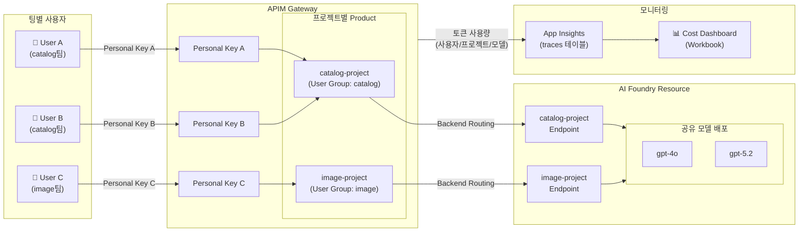
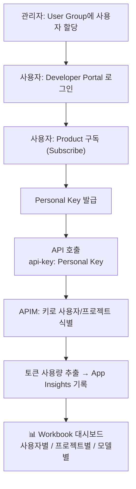

# apim-foundry-cost-governance

> 🇺🇸 [English Version](README.en.md)

Azure API Management(APIM)를 AI Foundry 앞단 게이트웨이로 배치하여, 팀별 Foundry Project에 대한 접근 제어·사용량 제한·토큰 사용량 모니터링을 단일 Terraform 배포로 구성하는 프로젝트입니다. 관리자는 Azure Portal에서 프로젝트를 추가하고 사용자에게 키를 발급하며, Application Insights Workbook을 통해 프로젝트별·모델별·사용자별 비용을 실시간으로 파악할 수 있습니다.

## 아키텍처



### 키 동작 방식



- **Foundry Resource** — 환경당 1개의 공유 `Microsoft.CognitiveServices/accounts` 리소스. 모든 모델 배포를 포함
- **Foundry Project** — Foundry Resource 하위 자식 리소스. 팀(catalog팀, image팀 등)과 1:1 매핑되며, 각각 독립된 Foundry Endpoint를 가짐
- **APIM Instance** — 모든 Foundry Endpoint를 백엔드로 프록시하는 단일 게이트웨이. 인증·라우팅·사용량 제한 담당
- **App Insights** — APIM outbound policy에서 토큰 사용량을 추출하여 custom dimension으로 기록. Workbook 대시보드로 시각화

## 주요 개념

| 개념 | 설명 |
|---|---|
| **Service Key** | Terraform이 Foundry Project당 1개 생성하는 APIM Subscription 키. CI/CD·자동화 스크립트 등 시스템 용도 |
| **Personal Key** | 사용자가 Developer Portal에서 직접 구독하여 발급받는 개인별 APIM Subscription 키. 사용자별 사용량 추적 단위 |
| **User Group** | APIM 내 사용자 그룹. Foundry Project와 1:1 매핑되어 해당 프로젝트 리소스에 접근할 수 있는 사용자 집합 |
| **Developer Portal** | 사용자가 자신의 User Group에 연결된 Product에 구독하고 Personal Key를 셀프서비스로 발급·재발급하는 포털 |

## 사전 요구사항

- **Azure Subscription** — APIM, AI Services 리소스를 생성할 수 있는 권한 (Contributor 이상)
- **Azure CLI** — `az login` 완료 상태
- **Terraform** ≥ 1.5
- **Python** ≥ 3.10 (노트북·스크립트 실행 시)
- **Resource Provider 등록** — `Microsoft.ApiManagement`, `Microsoft.CognitiveServices`, `Microsoft.Insights`

## 빠른 시작

```bash
# 1. 리포지토리 클론
git clone https://github.com/jihys/apim-foundry-cost-governance.git
cd apim-foundry-cost-governance

# 2. terraform.tfvars 설정
cp infra/terraform.tfvars.example infra/terraform.tfvars
#    → subscription_id, apim_name, foundry_projects, model_deployments 등 편집

# 3. Terraform 배포
cd infra
terraform init
terraform apply
#    ⚠️ APIM 프로비저닝에 30–45분 소요

# 4. Developer Portal 관리 UI 열기 (최초 1회)
#    Azure Portal → APIM 리소스 → Developer Portal → 관리 UI에서 "Publish" 클릭

# 5. (선택) Portal 초기 설정 스크립트
cd ..
bash scripts/setup-portal.sh

# 6. 사용자 추가
#    → 가이드북 참조: docs/guidebook/03-add-user.md
```

자세한 단계별 안내는 아래 가이드북을 참조하세요.

## 디렉터리 구조

```
apim-foundry-cost-governance/
├── infra/                    # Terraform IaC
│   ├── modules/
│   │   ├── apim/             # APIM instance, products, subscriptions
│   │   ├── foundry/          # Foundry resource, projects, deployments
│   │   ├── monitoring/       # App Insights, Log Analytics, Workbook
│   │   └── networking/       # VNet, Private Endpoints (선택)
│   ├── main.tf
│   ├── variables.tf
│   ├── outputs.tf
│   └── terraform.tfvars.example
├── scripts/                  # 자동화 스크립트
│   └── setup-portal.sh       # Developer Portal 초기 설정
├── docs/
│   └── guidebook/            # Step-by-step 운영 가이드 (한국어/English)
└── notebooks/                # 분석 & 데모 노트북
```

## 가이드북

| 문서 | 내용 |
|---|---|
| [01. 초기 설정](docs/guidebook/01-initial-setup.md) | Terraform 배포, Resource Provider 등록, APIM 프로비저닝 |
| [02. 프로젝트 추가](docs/guidebook/02-add-project.md) | Foundry Project 추가 (Terraform 또는 Portal) |
| [03. 사용자 추가](docs/guidebook/03-add-user.md) | User Group 할당, Developer Portal 사용자 등록 |
| [04. 사용자 빠른 시작](docs/guidebook/04-user-quickstart.md) | End-user를 위한 API 호출 가이드 |
